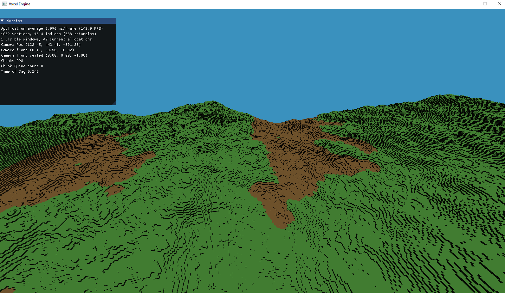

# Voxel
Very small and simple voxel landscape generator

### On Windows
 - Download Visual Studio Community
 - Download SDL2 and place the `include` and `lib` folders inside `external`
 - Place the SDL.dll on the root folder
 - Download GLM and place the `include` folder inside the `external` folder
 - With CMake define the SDL2 and GLM includes to be the external folder
 - Generate and Open the solution on Visual Studio.

### On Linux:
 - Install sdl2 (and g++) with `sudo apt install cmake libsdl2-dev g++`
 - Download GLM and place the `include` folder inside the `external` folder
 - Run `cmake .` on the root folder.
 - Run `make` on the generated Makefile, and then ./raytracer

Sources:
[LearnOpenGL website/book](https://learnopengl.com/)
[Lets make a voxel engine](https://sites.google.com/site/letsmakeavoxelengine/home/)
[Perlin noise tutorial](https://www.youtube.com/watch?v=kCIaHqb60Cw)
[Minecraft clone in C++](https://www.youtube.com/watch?v=v0Ks1dCMlAA)
